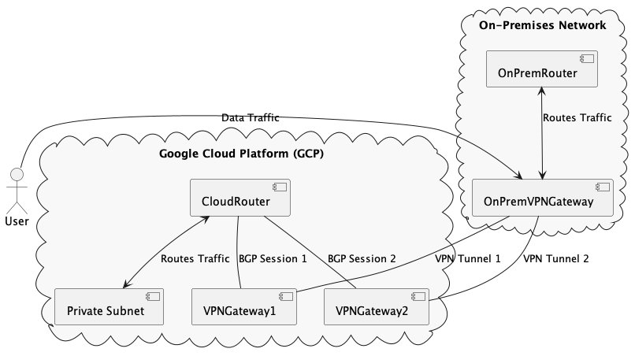

# db2viz

db2viz is a data pipeline project that demonstrates how to move data from an on-premises database (Postgres) to Google Cloud BigQuery for visualization in Looker Studio.


## Project Structure

- `cmd/main.go`: The entry point for the application.
- `config/config.go`: Configuration loader.
- `internal/db/postgres_connector.go`: Connects to the Postgres database.
- `internal/db/db.go`: Contains logic for connecting to the database and loading data.
- `internal/data/loader.go`: Loads data from Postgres.
- `internal/data/transformer.go`: Transforms data before uploading.
- `internal/gcp/pubsub.go`: Publishes data to Google Cloud Pub/Sub.
- `scripts/run_postgres_docker.sh`: Script to run a Postgres container.

## Getting Started

1. Run the Postgres Docker container

    ```sh
    ./scripts/run_postgres_docker.sh
    ```

2. Configure your `config/config.yaml` with the necessary details for Postgres and Google Cloud Pub/Sub.

    ```yaml
    postgres:
        host: localhost
        port: 5432
        user: postgres
        password: mysecretpassword
        dbname: tfmv
        sslmode: disable
        tables:
            - name: nation
              schema: production
              topic_id: nation
            - name: regions
              schema: production
              topic_id: regions
        concurrency: 2

    pubsub:
        project_id: tfmv-371720
        credentials: /path/to/your/service-account.json 
        workers: 20
    ```

3. Build and run the Go application

    ```sh
    docker build -t db2viz .
    docker run --rm db2viz
    ```

## Description

This project demonstrates a simple ETL (Extract, Transform, Load) pipeline:

1. **Extract**: Data is extracted from a Postgres database.
2. **Transform**: The data is transformed as necessary within the application.
3. **Load**:
   - The transformed data is published to a Google Cloud Pub/Sub topic.
   - Pub/Sub subscriptions are used to directly populate the BigQuery tables as the data streams into Pub/Sub.

The data is ultimately loaded into Google BigQuery for visualization in Looker Studio.

## Using Pub/Sub to BigQuery

To stream data from Pub/Sub to BigQuery, follow these steps:

1. Ensure you have the necessary permissions and enable the required APIs for Pub/Sub and BigQuery in your Google Cloud project.
2. Create Pub/Sub subscriptions that write directly to BigQuery:
    - Define a subscription for each Pub/Sub topic associated with your tables.
    - Configure the subscription to use a push endpoint that writes to BigQuery.

## Visualizing Data in Looker Studio

Once the data is in BigQuery, you can use Looker Studio to visualize it:

1. Go to Looker Studio (formerly Data Studio).
2. Click on "Create" and select "Data Source".
3. Choose "BigQuery" as the connector.
4. Select your Google Cloud project, dataset, and table.
5. Click "Connect".
6. Create your report and add visualizations as needed.

## Networking

To set up connectivity between your on-premises network and Google Cloud, you can use one of the following methods:

### Cloud VPN

1. **Create a Cloud VPN Gateway**: Establish a VPN gateway in GCP.
2. **Configure VPN Tunnels**: Set up IPsec tunnels between your on-premises VPN gateway and the GCP VPN gateway.
3. **Use Cloud Router**: Configure dynamic routing using BGP.
4. **Configure Firewall Rules**: Allow traffic between on-premises and GCP.

### Cloud Interconnect

For higher bandwidth and lower latency:

1. **Order Circuits**: Arrange for dedicated or partner interconnect circuits.
2. **Create Interconnect Connection**: Establish a physical connection to GCP.
3. **Configure VLAN Attachments**: Set up VLANs for traffic routing.
4. **Use Cloud Router**: Manage dynamic routing.

### Networking Example

To set up an HA VPN:

1. **Create an HA VPN Gateway**:

```sh
   gcloud compute target-vpn-gateways create ha-vpn-gateway --region us-central1
```


