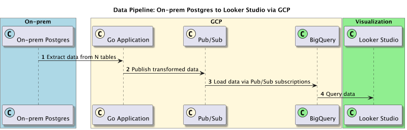

# db2viz

db2viz is a data pipeline project that demonstrates how to move data from an on-premises database (Postgres) to Google Cloud BigQuery for visualization in Looker Studio.



## Project Structure

- `cmd/main.go`: The entry point for the application.
- `config/config.go`: Configuration loader.
- `internal/db/postgres_connector.go`: Connects to the Postgres database.
- `internal/db/db.go`: Contains logic for connecting to the database and loading data.
- `internal/data/loader.go`: Loads data from Postgres.
- `internal/data/transformer.go`: Transforms data before uploading.
- `internal/gcp/pubsub.go`: Publishes data to Google Cloud Pub/Sub.
- `scripts/run_postgres_docker.sh`: Script to run a Postgres container.

## Getting Started

1. Run the Postgres Docker container

    ```sh
    ./scripts/run_postgres_docker.sh
    ```

2. Configure your `config/config.yaml` with the necessary details for Postgres and Google Cloud Pub/Sub.

    ```yaml
    postgres:
    host: localhost
    port: 5432
    user: postgres
    password: mysecretpassword
    dbname: tfmv
    sslmode: disable
    tables:
        - name: nation
        topic_id: nation
        - name: regions
        topic_id: regions
    concurrency: 2

    pubsub:
    project_id: tfmv-371720
    credentials: /path/to/your/service-account.json 
    ```

3. Build and run the Go application

    ```sh
    docker build -t db2viz .
    docker run --rm db2viz
    ```

## Description

This project demonstrates a simple ETL (Extract, Transform, Load) pipeline:

1. **Extract**: Data is extracted from a Postgres database.
2. **Transform**: The data is transformed as necessary within the application.
3. **Load**: 
   - The transformed data is published to a Google Cloud Pub/Sub topic.
   - A ready-made Dataflow template is used to stream data from Pub/Sub to BigQuery.

The data is ultimately loaded into Google BigQuery for visualization in Looker Studio.

## Using Dataflow

To stream data from Pub/Sub to BigQuery, follow these steps:

1. Ensure you have the necessary permissions and enable the required APIs for Dataflow, Pub/Sub, and BigQuery in your Google Cloud project.
2. Create a Dataflow job using the Pub/Sub to BigQuery template:
    - Go to the Google Cloud Console.
    - Navigate to Dataflow > Jobs.
    - Click on "Create job from template".
    - Select the "Pub/Sub to BigQuery" template.
    - Fill in the required parameters:
        - **Job name**: A unique name for your Dataflow job.
        - **Pub/Sub topic**: The full name of the Pub/Sub topic (e.g., `projects/your-project/topics/flights-topic`).
        - **BigQuery output table**: The BigQuery table where the data will be written (e.g., `your-project:dataset.flights`).
    - Click "Run job".

## Visualizing Data in Looker Studio

Once the data is in BigQuery, you can use Looker Studio to visualize it:

1. Go to Looker Studio (formerly Data Studio).
2. Click on "Create" and select "Data Source".
3. Choose "BigQuery" as the connector.
4. Select your Google Cloud project, dataset, and table.
5. Click "Connect".
6. Create your report and add visualizations as needed.

This setup provides a robust and scalable way to handle data movement from an on-premises database to a cloud-based data warehouse, making it accessible for advanced analytics and visualization.
